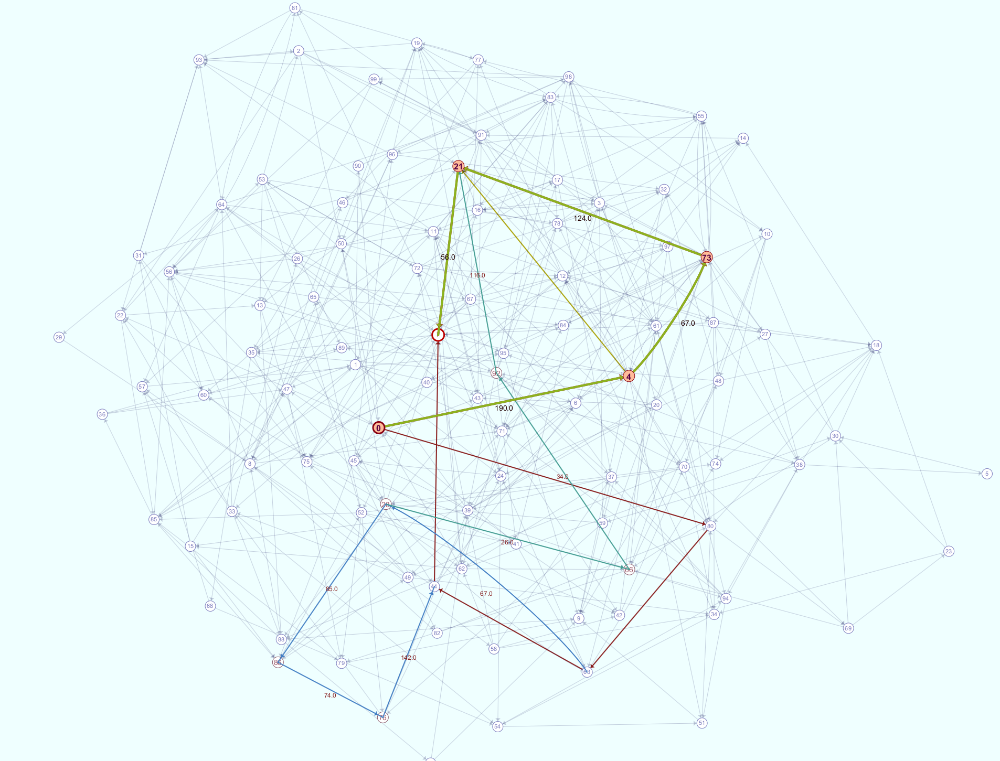

# bb4-shortest-paths

Some shortest path algorithm implementations and visualizations.
 - Dijkstra's algorithm - single-source shortest paths 
 - ModifiedDijkstra's - shortest path between two nodes
 - Yen's algorithm - finds the K shortest paths between two nodes

A GraphViewerApp is also provided. It allows you to view the graph test cases.

## How to use it

Run ./gradlew to build and run the tests.

The default application is the GraphViewerApp. It allows you to view the graph tests cases and their results.
For example, here is a shortest path result for sp_120 example. For Dijkstras and ModifiedDijkstras, you can mouse over a node to see the shortest path to that node.

  
For Yens and Eppsteins algorithm, you can mouse over nodes or edges to see the shortest paths that pass through that respective node or edge. There is a different color for each of the k-shortest paths found.

Future Features
 - add other variations of Eppsteins algorithm.

