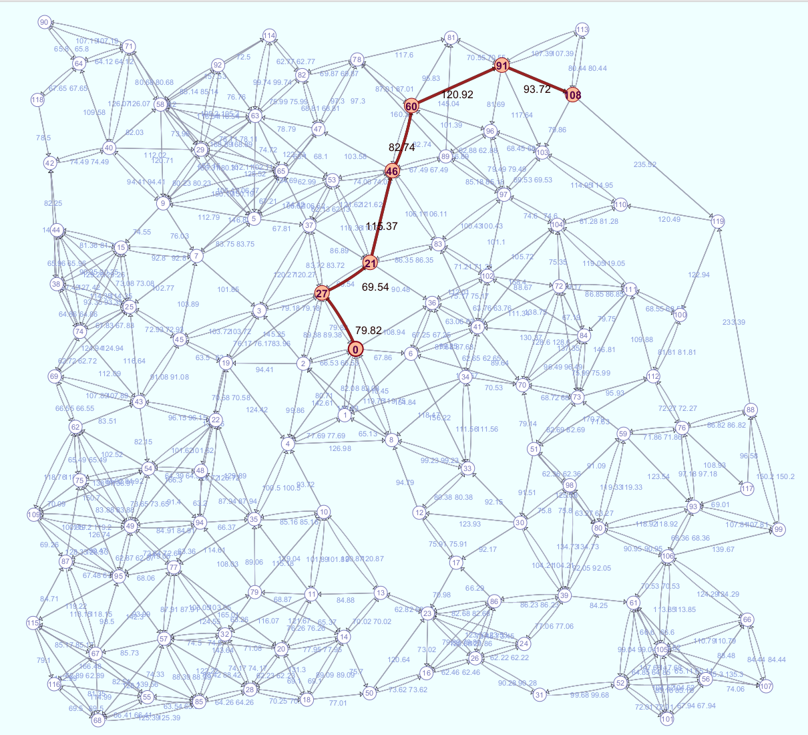

# bb4-shortest-paths

Some shortest path algorithm implementations and visualizations.
 - Dijkstra's algorithm - single-source shortest paths 
 - ModifiedDijkstra's - shortest path between two nodes
 - Yen's algorithm - finds the K shortest paths between two nodes

A GraphViewerApp is also provided. It allows you to view the graph test cases.

## How to use it

Run ./gradlew to build and run the tests.

The default application is the GraphViewerApp. It allows you to view the graph tests cases and their results.
For example, here is a shortest path result

Future Features
- For k-shortest paths, color the paths with gradient colors to differentiate them. Best path will be the darkest.
- Unify rendering of graphs, and shortest path results
- When mousing over nodes in the viewer
  - If shortest path, show the shortest path to node on mouseover (for dijkstras)
  - If shortest k-paths, show the shortest path containing that node if there is one.

